![maintained-shield]
![Stargazers][stars-shield]
[![LinkedIn][linkedin-shield]][linkedin-url]

# NerdStore-Enterprise

## Plataforma de E-commerce – ASP.NET Core & Arquitetura Corporativa

<details open="open">
  <summary><strong>Conteúdo</strong></summary>
  <ol>
    <li>
      <a href="#sobre-o-projeto">Sobre o Projeto</a>
      <ul>
        <li><a href="#tecnologias-e-ferramentas">Tecnologias e Ferramentas</a></li>
        <li><a href="#arquitetura">Arquitetura</a></li>        
      </ul>
    </li>
    <li>
      <a href="#features">Features</a>
      <ul>
        <li><a href="#backend">Backend</a></li>
        <li><a href="#frontend">Frontend</a></li>        
      </ul>
    </li>
    <li>
      <a href="#getting-started">Getting Started</a>
      <ul>
        <li><a href="#requisitos">Requisitos</a></li>
        <li><a href="#instalação">Instalação</a></li>
      </ul>
    </li>
    <li>
      <a href="#evidências-operacionais">Evidências Operacionais</a>
      <ul>
        <li><a href="#ecommerce-nerdstore-enterprise">Ecommerce NerdStore Enterprise</a></li>
        <li><a href="#rabbitmq-dashboard-geral">RabbitMQ Dashboard Geral</a></li>
        <li><a href="#rabbitmq-conexões-dos-microsserviços">RabbitMQ Conexões dos Microsserviços</a></li>        
        <li><a href="#rabbitmq-canais-ativos">RabbitMQ Canais Ativos</a></li>
        <li><a href="#rabbitmq-exchanges-configuradas">RabbitMQ Exchanges Configuradas</a></li>
        <li><a href="#rabbitmq-filas-ativas">RabbitMQ Filas Ativas</a></li>
        <li><a href="#banco-de-dados-aspnet-users">Banco de Dados ASPNet Users</a></li>
        <li><a href="#banco-de-dados-clientes">Banco de Dados Clientes</a></li>
      </ul>
    </li>    
    <li>
      <a href="#materiais-executivos-e-diagramas-avançados">Materiais Executivos e Diagramas Avançados</a>
      <ul>
        <li><a href="#descrições-executivas">Descrições Executivas</a></li>
        <li><a href="#versões-em-alta-resolução">Versões em Alta Resolução</a></li>
        <li><a href="#diagramas-adicionais-disponíveis">Diagramas Adicionais Disponíveis</a></li>            
      </ul>
    </li>    
    <li><a href="#roadmap">Roadmap</a></li>
    <li><a href="#licença">Licença</a></li>    
  </ol>
</details>

---

## Sobre o Projeto

O **NerdStore-Enterprise** é um ambiente corporativo de e-commerce concebido para atender requisitos de escalabilidade, governança e continuidade operacional. A solução aplica padrões arquiteturais consolidados, provendo um baseline técnico robusto para iniciativas de produto e operações.

---

### Tecnologias e Ferramentas

- **ASP.NET Core 3.1** / **C# 8**
- **Entity Framework Core**
- **SQL Server**
- **Docker & Docker Compose**
- **RabbitMQ (AMQP) + Management UI**
- **NGINX**
- **Identity (JWT, Cookies, Refresh Tokens)**
- **gRPC (quando aplicável)**
- **Swagger / OpenAPI**
- **Redis (Cache distribuído)**
- **Frontend: WebApp MVC**
- **Repositório: GitHub**

---

### Arquitetura

- Arquitetura de **Microsserviços**.
- Padrões **DDD (Domain-Driven Design)** e **CQRS** quando aplicável.
- **Event-Driven Architecture** com RabbitMQ (Publish/Subscribe).
- Separação por camadas: API, Application/Business, Data.
- API Gateway e mecanismos de segurança centralizados.

---

## Features

### Backend
- Gestão de catálogo (produtos, estoque, categorias).
- Fluxo completo de compras (carrinho, vouchers, pedidos).
- Orquestração de pagamentos e eventos transacionais.
- Autenticação e autorização centralizadas.
- Integração assíncrona via RabbitMQ.

### Frontend
- WebApp MVC para orquestração do fluxo do usuário.
- Páginas responsivas, navegação estruturada e componentes reutilizáveis.
- Integração com APIs e API Gateway.

---

## Getting Started

### Requisitos
- .NET SDK 3.1+
- Docker Desktop
- SQL Server (local ou container)
- Git

### Instalação
**Clone o repositório:**
```bash
git clone https://github.com/medidrones/NerdStore_Enterprise
```

**Navegue até a pasta do projeto:**
```bash
cd .\NerdStore_Enterprise\docker
```

**Dentro da pasta "docker" do projeto, executar "docker-compose" para publicação:
```bash
docker-compose -f nerdstore_producao.yml up --scale web-mvc=4
```

**Após executar "docker-compose", acessar o link do E-commerce:
```bash
https://localhost/vitrine
```
---

## Evidências Operacionais

### Ecommerce NerdStore Enterprise
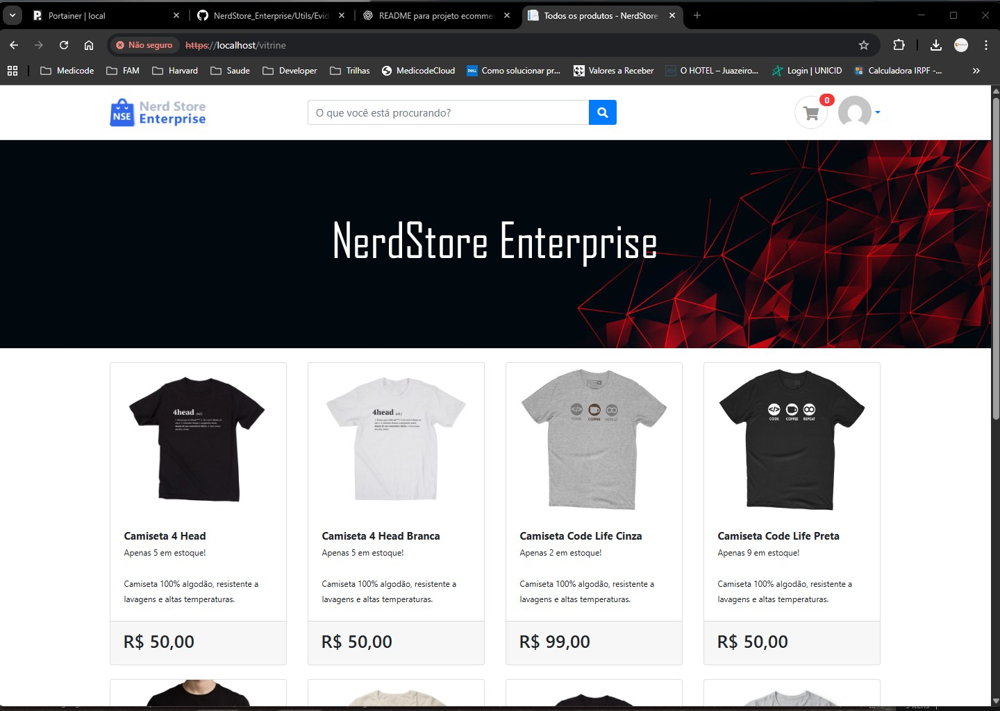

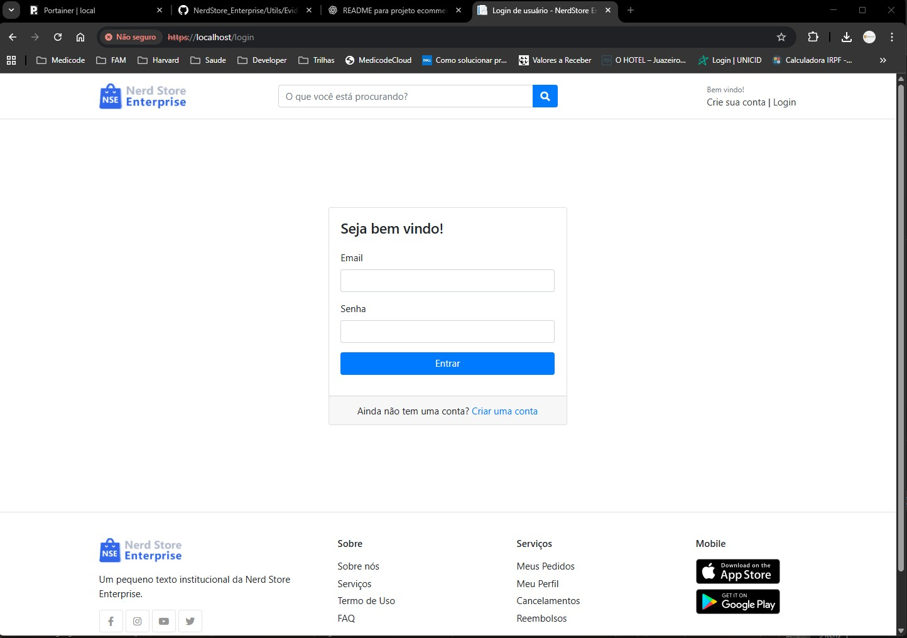

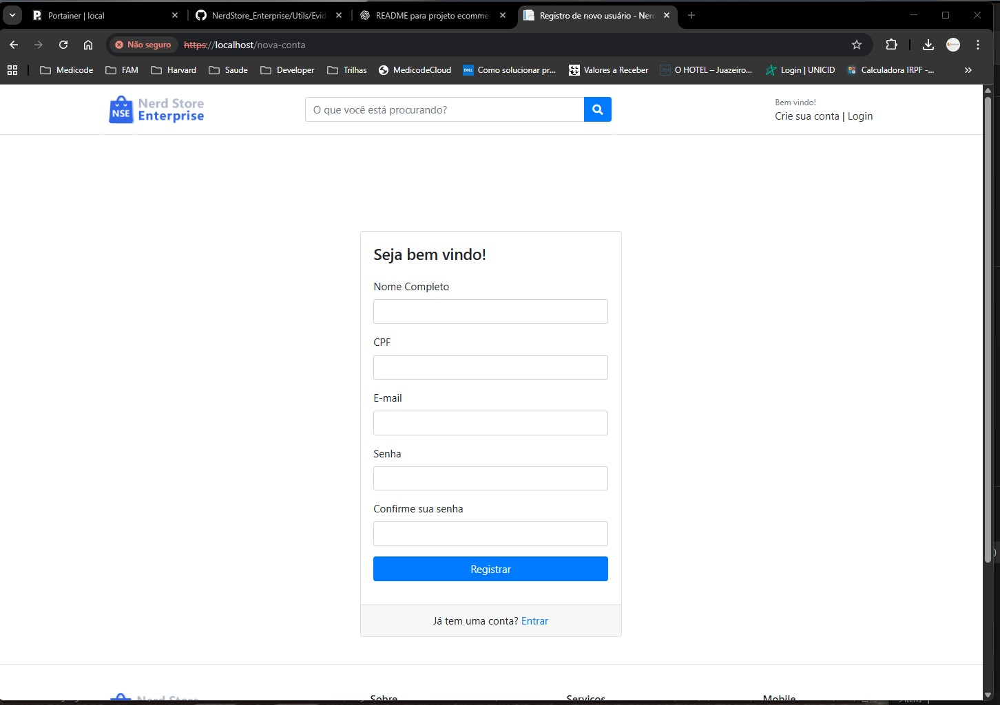

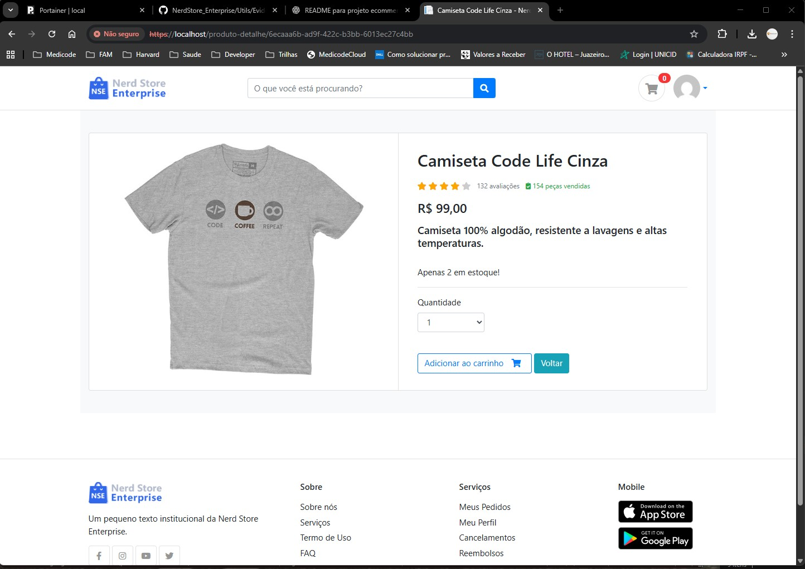

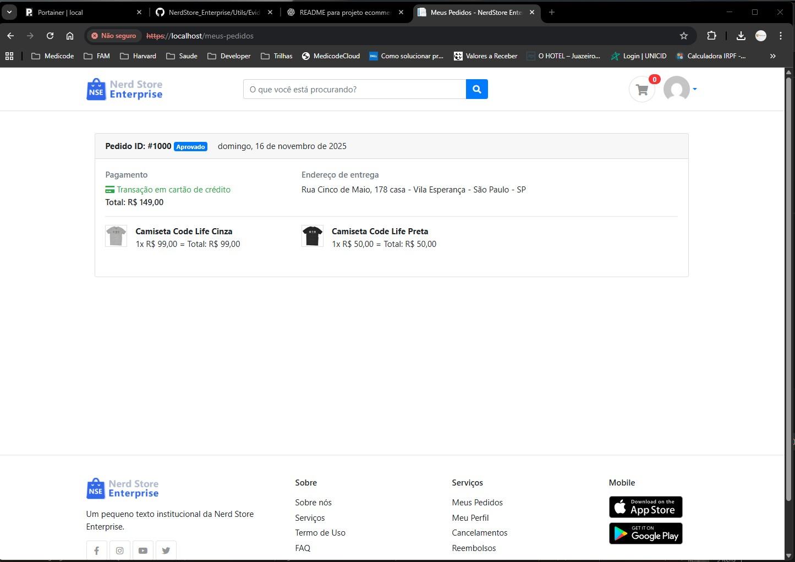

### RabbitMQ Dashboard Geral


### RabbitMQ Conexões dos Microsserviços


### RabbitMQ Canais Ativos
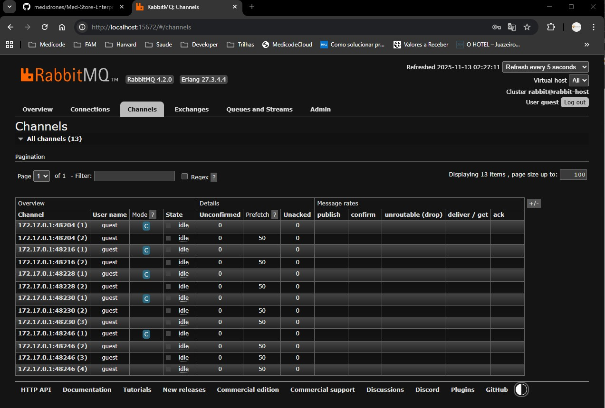

### RabbitMQ Exchanges Configuradas


### RabbitMQ Filas Ativas
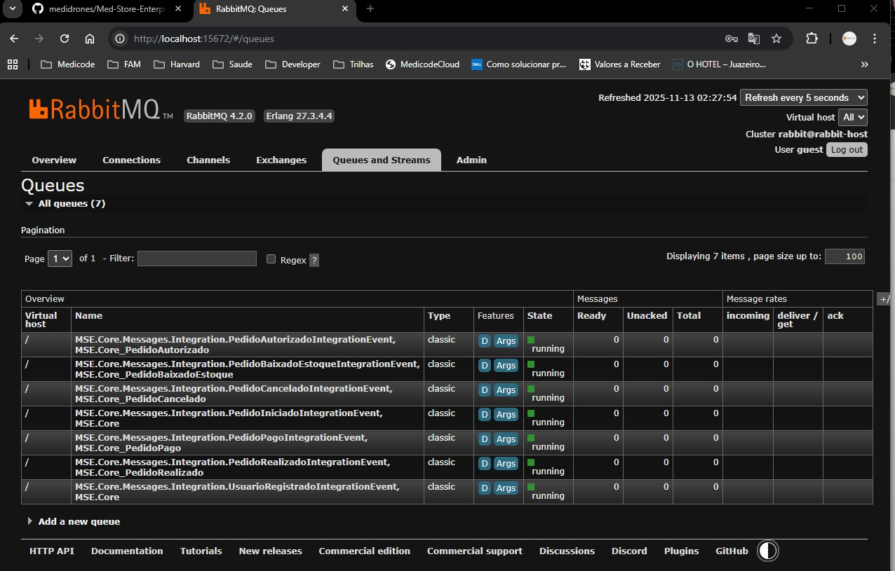

### Banco de Dados ASP.NET Users
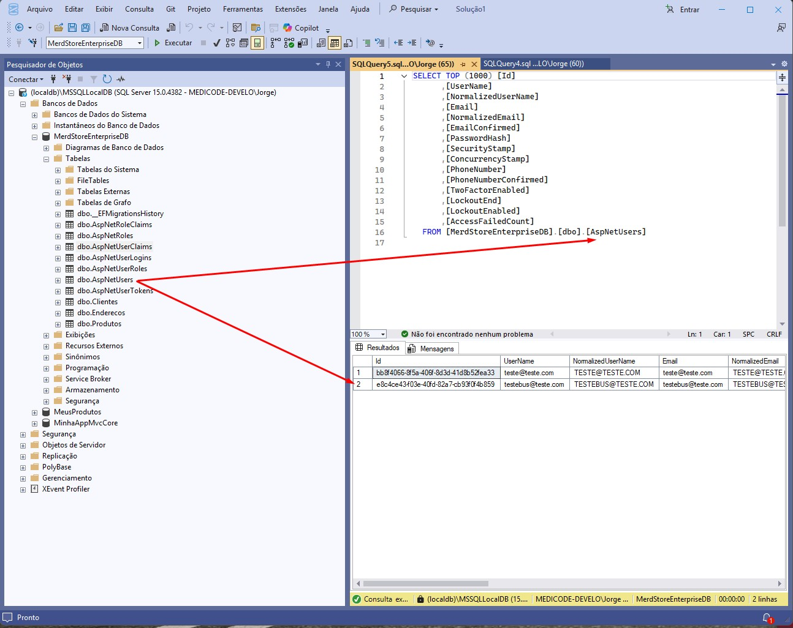

### Banco de Dados Clientes


---

## Materiais Executivos e Diagramas Avançados

### Descrições Executivas
A solução adota um ecossistema baseado em microsserviços desacoplados, sustentado por uma infraestrutura orientada a eventos. Cada módulo corporativo atua de forma autônoma, garantindo escalabilidade e resiliência. O WebApp MVC desempenha o papel de orquestrador da experiência do usuário, enquanto o RabbitMQ consolida o barramento de integração, assegurando comunicação assíncrona de alta disponibilidade.

O Serviço de Identidade opera sob padrões de mercado utilizando JWT, Cookies e o pipeline de autenticação do ASP.NET Core. Essa separação fortalece políticas de segurança, compliance e auditoria contínua. Além disso, o módulo de Catálogo segue camadas isoladas (API, Business e Data), reforçando as boas práticas de DDD e padrões arquiteturais corporativos.

### Versões em Alta Resolução
As imagens e diagramas podem ser disponibilizados em alta resolução (SVG ou PNG 4K) para uso em material executivo e apresentações institucionais.

### Diagramas Adicionais Disponíveis
- **Banco de Dados**


- **Proposta de Arquitetura**


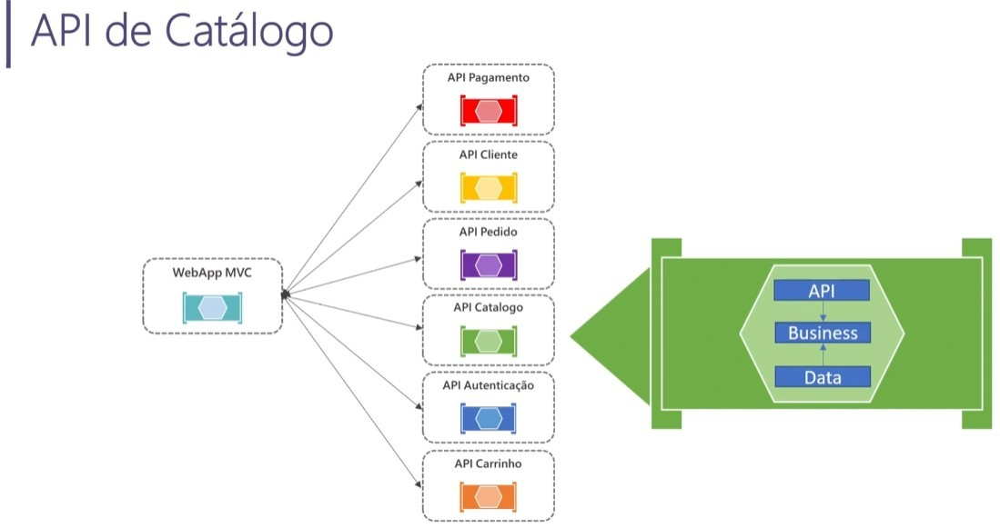

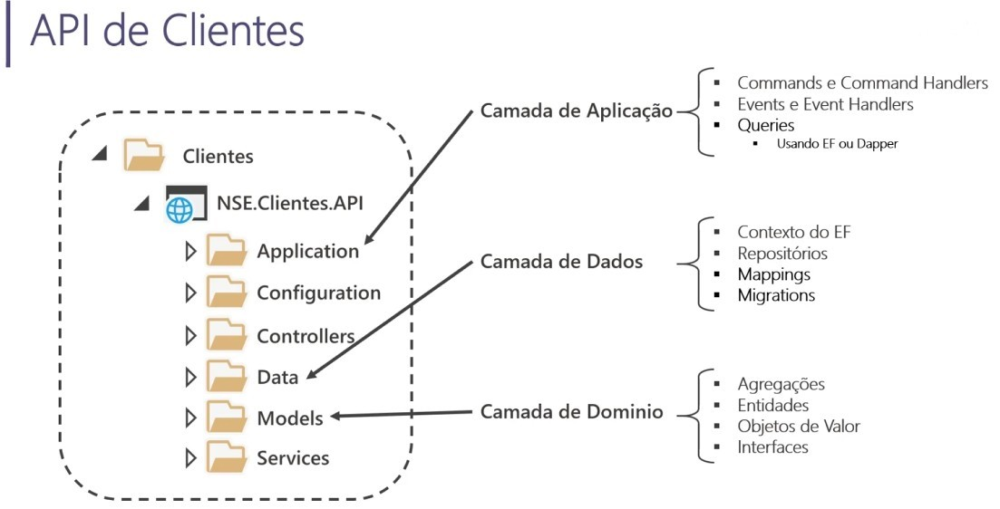

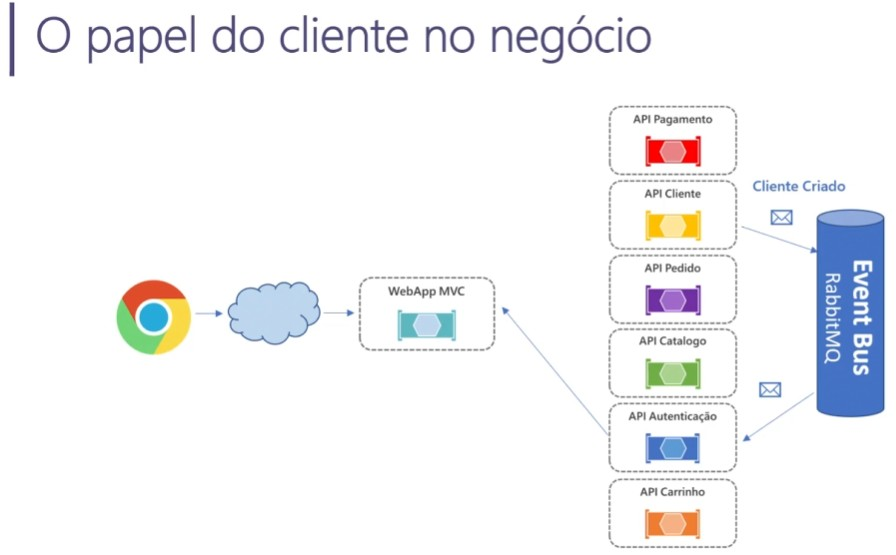

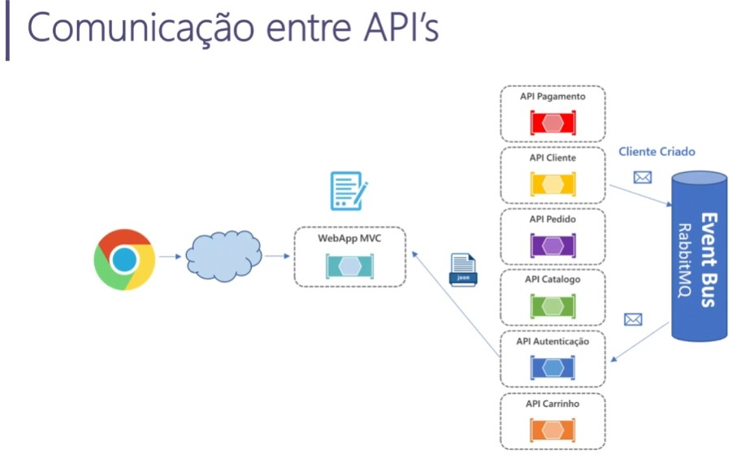

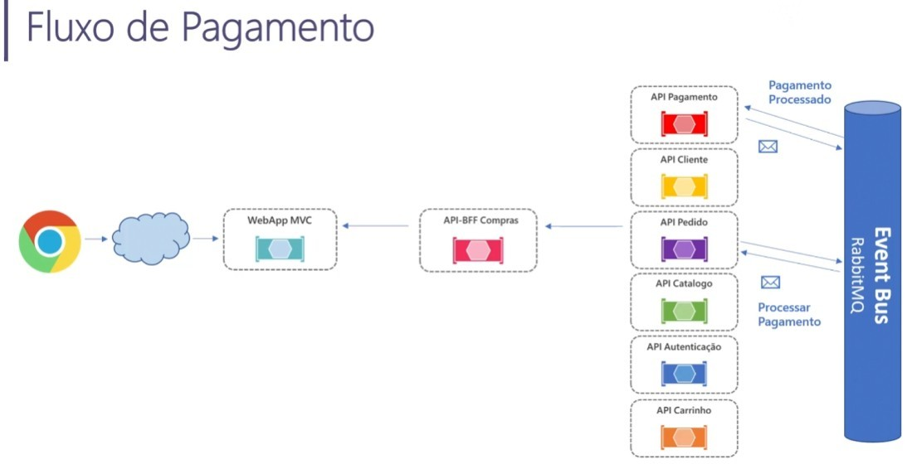

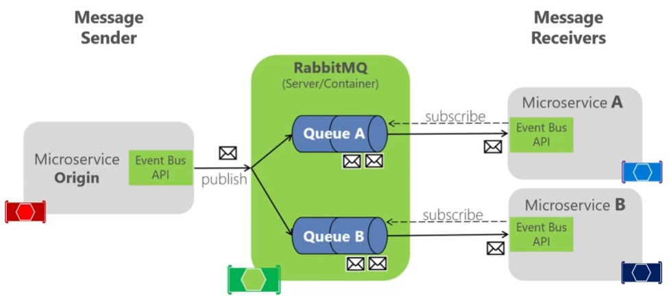

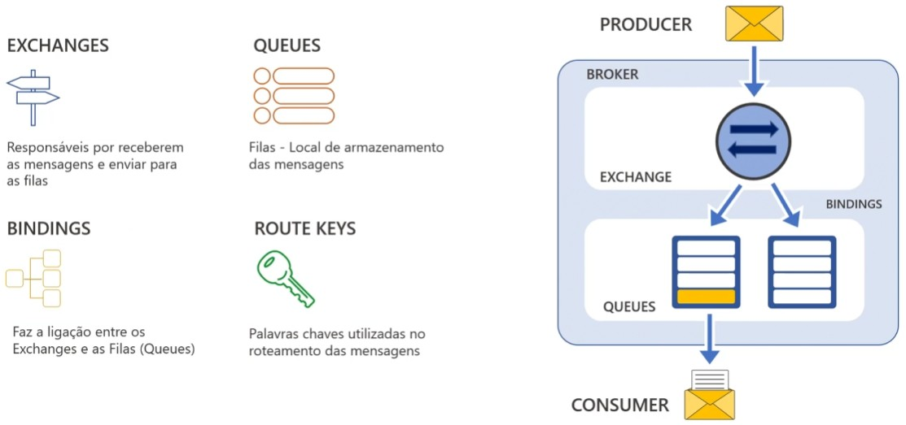

---

## Roadmap

- Testes (unitários)
- Testes exploratório (QA)
- Notificações assíncronas ampliadas

---

## Licença

Projeto distribuído sob a licença **MIT**. Consulte o arquivo LICENSE para detalhes.


